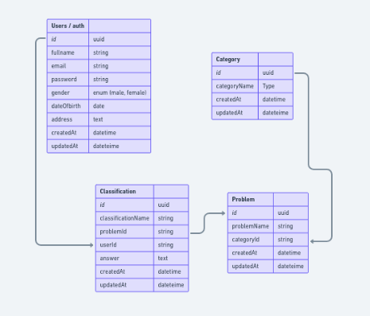

<p align="center">
  <a href="http://nestjs.com/" target="blank"></a>
</p>

# DSS (decision support system) Project

Simple application for Identification problem and provide some solution, build using Nest JS include any library like TypeOrm, class-validator, mysql2, bcrypt, etc

[](https://choosealicense.com/licenses/mit/)
[](https://opensource.org/licenses/)
[](http://www.gnu.org/licenses/agpl-3.0)

## Tech Stack

**Library and Framework:** Nest JS, JWT, TypeORM, class-validator, dotenv, mysql2, bcrypt, etc

## API Reference

#### Authentication

```bash
http:example.com:3000/auth/register/login
```

#### Categories

```bash
http:example.com:3000/categories
```

#### Problems

```bash
http:example.com:3000/problems
```

#### Classification

```bash
http:example.com:3000/classifications
```

#### More endpoint can clone/fork/download Postman Collection

[](https://god.gw.postman.com/run-collection/9050639-aac61fdd-3274-4bf3-9720-ee8c461274f1?action=collection%2Ffork&source=rip_markdown&collection-url=entityId%3D9050639-aac61fdd-3274-4bf3-9720-ee8c461274f1%26entityType%3Dcollection%26workspaceId%3Df0c55199-3b92-4de3-9900-d7129d74ec5f)

## Screenshots (Database Schema)



## Installation

```bash
$ yarn install
```

## Running the app

```bash
# development
$ yarn run start

# watch mode
$ yarn run start:dev

# production mode
$ yarn run start:prod
```

## Test

```bash
# unit tests
$ yarn run test

# e2e tests
$ yarn run test:e2e

# test coverage
$ yarn run test:cov
```

## Support

Nest is an MIT-licensed open source project. It can grow thanks to the sponsors and support by the amazing backers. If you'd like to join them, please [read more here](https://docs.nestjs.com/support).

---

Copyright © 2023 by Muhamad Zainal Arifin

> The Project is Under MIT licensed.
